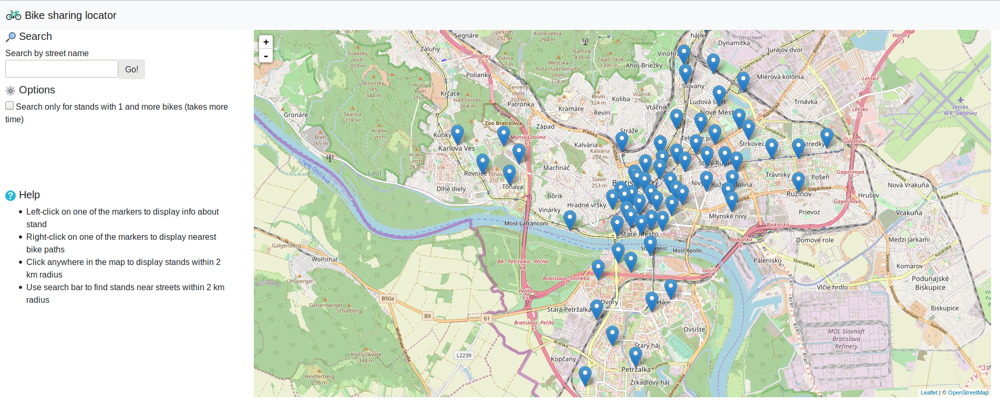

*This is a documentation for a fictional project, just to show you what I expect. Notice a few key properties:*
- *no cover page, really*
- *no copy&pasted assignment text*
- *no code samples*
- *concise, to the point, gets me a quick overview of what was done and how*
- *I don't really care about the document length*
- *I used links where appropriate*

# Overview

This application shows bicycle stands of WhiteBike bike sharing in Bratislava on a map. Most important feautres are:
- displaying all stands in Bratislava on a map with option to see how many bikes are docked at the stand.
- displaying stands closest to selected location (with option to display only stands with bikes).
- displaying stands closest to selected street (with option to display only stands with bikes).
- displaying bike paths closest to selected stand.

Overview of the application



The application is built with Flask framework and Leaflet. Additionaly, Bootstrap and jQuery were used to operate the frontend part of the project. The backend part provides several REST API endpoints to get data in GeoJSON format, later to be displayed using Leaflet.


# Frontend

The frontend application is a static HTML page (`index.html`), which shows a leaflet.js widget. It uses jQuery to connect to REST API and get GeoJSON data to be displayed on the map using Leaflet.

The markers on the map are modified using custom icons to distinguish stands with bikes and those without them. 

All relevant frontend code is in `lfunctions.js` which is referenced from `index.html`.

# Backend

The backend application is written in Flask framework and is responsible for providing REST API for the frontend part. It also queries the data from PostGIS database and WhiteBike API. All database operations are located within file `wb.py`.

## Data

Data about WhiteBike stands is coming from Open Street Maps. I exported area aprox. the size of Bratislava (due to the fact that WhiteBikes are operational only in Bratislava). I imported it using `osm2pgsql` tool. GeoJSON is genereted directly in queries using `st_asgeojson` function. Some results are then altered and filtered by accessing WhiteBikes API and filtering empty stands.

## Api

**Find all stands in database**

`GET /stands`

### Response

List of all stands with ID in OSM database, their name and GeoJSON object with their coordinates.

```
[
    [
        4921143809,
        "DANUBIA",
        "{\"type\":\"Point\",\"coordinates\":[17.0945421,48.107061199912]}"
    ],
    [
        4921143810,
        "TUPOLEVOVA",
        "{\"type\":\"Point\",\"coordinates\":[17.1034706,48.1159139999099]}"
    ],
    [
        4921143769,
        "TECHNOPOL",
        "{\"type\":\"Point\",\"coordinates\":[17.111109,48.111329999911]}"
    ],
    [
        4921143807,
        "RIVER",
        "{\"type\":\"Point\",\"coordinates\":[17.0895691,48.1410788999038]}"
    ],
    [
        4921143816,
        "MATFYZ",
        "{\"type\":\"Point\",\"coordinates\":[17.069897,48.1511349999014]}"
    ],
    [
        4921145322,
        "JURIGOVO",
        "{\"type\":\"Point\",\"coordinates\":[17.061105,48.1535051999008]}"
    ],
    [
        4921145321,
        "KARLOVKA",
        "{\"type\":\"Point\",\"coordinates\":[17.0528479,48.1597357998993]}"
    ],
    ...

```


**Find nearest stands relative to given coordinates**

`GET /stands/nearest?lat=48.17341248658084&lng=17.120561599731445&not_empty=false`


### Response

List of given stands that are closest to relative location

```
[
    [
        4921143762,
        "PRISTAV",
        236
    ],
    [
        4921143767,
        "SAFKO",
        448
    ],
    [
        4921143779,
        "REDUTA",
        471
    ],
	...
```


**Find nearest stands relative to given street name**


`GET /stands/nearest/medená&not_empty=false`


### Response

List of given stands with ID in OSM database, name and id of stand in WhiteBike database

```
[
    [
        4921143762,
        "PRISTAV",
        236
    ],
    [
        4921143767,
        "SAFKO",
        448
    ],
    [
        4921143779,
        "REDUTA",
        471
    ],
	...
```


**Find bike paths near selected stand**

`GET /stand/4921143784/paths`

### Response

List of GeoJSON objects representing nearest bike paths


```
[
    [
        "{\"type\":\"LineString\",\"coordinates\":[[17.1161982,48.1412809999038],[17.1162873,48.1412243999038],[17.1163512,48.1411809999038],[17.1164935,48.1410844999038],[17.1166358,48.1409878999039],[17.116707,48.1409395999039]]}"
    ],
    [
        "{\"type\":\"LineString\",\"coordinates\":[[17.1155093,48.1419033999036],[17.1154388,48.1419054999036]]}"
    ],
    [
        "{\"type\":\"LineString\",\"coordinates\":[[17.1161072,48.1420722999036],[17.1160847,48.1420742999036],[17.1160589,48.1420706999036],[17.1155993,48.1419301999036],[17.1155093,48.1419033999036]]}"
    ],
    [
        "{\"type\":\"LineString\",\"coordinates\":[[17.1161386,48.1420263999036],[17.1161072,48.1420722999036]]}"
    ]
    .....
```

