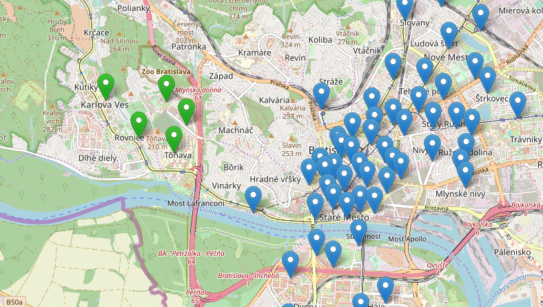
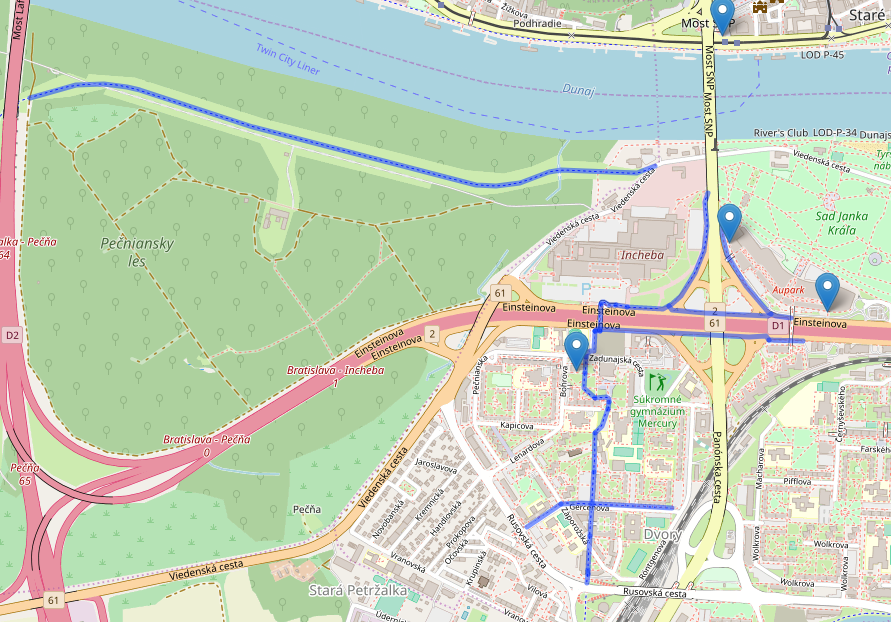
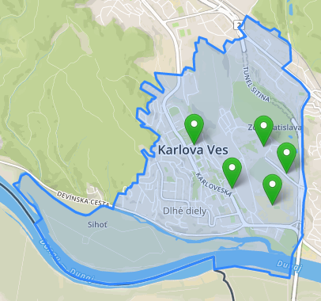

Martin Hauskrecht

# Overview

This application shows bicycle stands of WhiteBike bike sharing in Bratislava on a map. Most important feautres are:
- displaying all stands in Bratislava on a map with option to see how many bikes are docked at the stand.
- displaying stands closest to selected location (with option to display only stands with bikes).
- displaying stands closest to selected street (with option to display only stands with bikes).
- displaying stands within given city district
- displaying bike paths closest to selected stand.

Overview of the application








The application is built with Flask framework and MapBox SDK. Additionaly, Bootstrap and jQuery were used to operate the frontend part of the project. The backend part provides several REST API endpoints to get data in GeoJSON format, later to be displayed using Leaflet.


# Frontend

The frontend application is a static HTML page (`index.html`), which shows a MapBox widget. It uses jQuery to connect to REST API and get GeoJSON data to be displayed on the map using MapBox SDK.


## Custom map features

The markers on the map are modified using custom icons to distinguish stands with bikes and those without them. MapBox street map is used instead of classic openstreetmap theme.


All relevant frontend code is in `lfunctions.js` which is referenced from `index.html`.


# Backend

The backend application is written in Flask framework and is responsible for providing REST API for the frontend part. It also queries the data from PostGIS database and WhiteBike API. All database operations are located within file `wb.py`.

## Data

Data about WhiteBike stands is coming from Open Street Maps. I exported area aprox. the size of Bratislava (due to the fact that WhiteBikes are operational only in Bratislava). I imported it using `osm2pgsql` tool. GeoJSON is genereted directly in queries using `st_asgeojson` function. Some results are then altered and filtered by accessing WhiteBikes API and filtering empty stands.

### Query samples

**Selecting all stands from WhiteBikes bikesharing**

```
SELECT osm_id, name, st_asgeojson(way) from planet_osm_point  where amenity like 'bicycle_rental' and operator like 'WhiteBikes';
```


**Selecting stands with distance from given street within 2km radius**

```
SELECT osm_id, name, distance FROM (
WITH RECURSIVE streets AS (
SELECT osm_id, name, way FROM planet_osm_line
WHERE upper(name) = upper('Medená'))
SELECT DISTINCT ON (p.osm_id) p.osm_id, p.name, p.way,  trunc(st_distance(st_setsrid(p.way, 4326), st_setsrid(l.way, 4326))) AS distance FROM planet_osm_point p, streets l
where p.amenity = 'bicycle_rental' AND p.operator = 'WhiteBikes' AND ST_DWithin(st_setsrid(p.way, 4326), st_setsrid(l.way, 4326), 2000)) unordered_stands
ORDER BY distance;
```


**Selecting stands within city district**
```
SELECT DISTINCT point.osm_id, point.name
FROM planet_osm_polygon pol, planet_osm_point point
WHERE upper(pol.name) = upper('staré mesto') AND point.operator = 'WhiteBikes' and point.amenity like 'bicycle_rental' AND st_intersects(pol.way, point.way)

```

**Selecting stands closest to given coordinates with distance from the given coordinates**
```
SELECT osm_id, name, trunc(ST_Distance(way, st_transform( st_setsrid(st_makepoint(17.112, 48.143), 4326), 3857))) AS distance
FROM planet_osm_point
WHERE ST_DWithin(way, st_transform( st_setsrid(st_makepoint(17.112, 48.143), 4326), 3857), 2000)
AND amenity = 'bicycle_rental' and operator like 'WhiteBikes'
ORDER BY distance;
```

**Selecting 10 clocest bike paths to given stand within 2km radius**

```
SELECT st_asgeojson(st_transform(l.way, 4326)) FROM planet_osm_point p, planet_osm_line l
WHERE p.name = 'SAFKO' AND l.bicycle = 'designated' AND ST_DWithin(st_setsrid(p.way, 4326), st_setsrid(l.way, 4326), 2000)
LIMIT 10;
```

### Indexes

Based on created queries, I created these indexes. Use of them resulted in aprox. 11 times faster query execution (55 ms -> 5ms)

```
CREATE INDEX point_idx ON planet_osm_point(osm_id, name, operator, amenity);
CREATE INDEX line_idx ON planet_osm_line(osm_id, name);
CREATE INDEX line_bicycle_idx ON planet_osm_line(name, bicycle);
CREATE INDEX line_name_upper_idx ON planet_osm_line(upper(name));


CREATE INDEX line_gix ON planet_osm_line USING GIST(way);
CREATE INDEX point_gix ON planet_osm_point USING GIST(way);
```

## Api

**Find all stands in database**

`GET /stands`

### Response

List of all stands with ID in OSM database, their name and GeoJSON object with their coordinates.

```
[
    [
        4921143809,
        "DANUBIA",
        "{\"type\":\"Point\",\"coordinates\":[17.0945421,48.107061199912]}"
    ],
    [
        4921143810,
        "TUPOLEVOVA",
        "{\"type\":\"Point\",\"coordinates\":[17.1034706,48.1159139999099]}"
    ],
    [
        4921143769,
        "TECHNOPOL",
        "{\"type\":\"Point\",\"coordinates\":[17.111109,48.111329999911]}"
    ],
    [
        4921143807,
        "RIVER",
        "{\"type\":\"Point\",\"coordinates\":[17.0895691,48.1410788999038]}"
    ],
    [
        4921143816,
        "MATFYZ",
        "{\"type\":\"Point\",\"coordinates\":[17.069897,48.1511349999014]}"
    ],
    [
        4921145322,
        "JURIGOVO",
        "{\"type\":\"Point\",\"coordinates\":[17.061105,48.1535051999008]}"
    ],
    [
        4921145321,
        "KARLOVKA",
        "{\"type\":\"Point\",\"coordinates\":[17.0528479,48.1597357998993]}"
    ],
    ...

```


**Find nearest stands relative to given coordinates**

`GET /stands/nearest?lat=48.17341248658084&lng=17.120561599731445&not_empty=false`


### Response

List of given stands that are closest to relative location

```
[
    [
        4921143762,
        "PRISTAV",
        236
    ],
    [
        4921143767,
        "SAFKO",
        448
    ],
    [
        4921143779,
        "REDUTA",
        471
    ],
	...
```


**Find nearest stands relative to given street name**


`GET /stands/nearest/medená&not_empty=false`


### Response

List of given stands with ID in OSM database, name and id of stand in WhiteBike database

```
[
    [
        4921143762,
        "PRISTAV",
        236
    ],
    [
        4921143767,
        "SAFKO",
        448
    ],
    [
        4921143779,
        "REDUTA",
        471
    ],
	...
```


**Find bike paths near selected stand**

`GET /stand/4921143784/paths`

### Response

List of GeoJSON objects representing nearest bike paths


```
[
    [
        "{\"type\":\"LineString\",\"coordinates\":[[17.1161982,48.1412809999038],[17.1162873,48.1412243999038],[17.1163512,48.1411809999038],[17.1164935,48.1410844999038],[17.1166358,48.1409878999039],[17.116707,48.1409395999039]]}"
    ],
    [
        "{\"type\":\"LineString\",\"coordinates\":[[17.1155093,48.1419033999036],[17.1154388,48.1419054999036]]}"
    ],
    [
        "{\"type\":\"LineString\",\"coordinates\":[[17.1161072,48.1420722999036],[17.1160847,48.1420742999036],[17.1160589,48.1420706999036],[17.1155993,48.1419301999036],[17.1155093,48.1419033999036]]}"
    ],
    [
        "{\"type\":\"LineString\",\"coordinates\":[[17.1161386,48.1420263999036],[17.1161072,48.1420722999036]]}"
    ]
    .....
```

**Find bike stands within district**

`GET /stands/district/Karlova Ves`


```
[
    [
        4921143816,
        "MATFYZ"
    ],
    [
        4921143818,
        "BINARIUM"
    ],
    [
        4921143820,
        "ATRIAKY"
    ],
    [
        4921145321,
        "KARLOVKA"
    ],
    [
        4921145322,
        "JURIGOVO"
    ]
]
```


